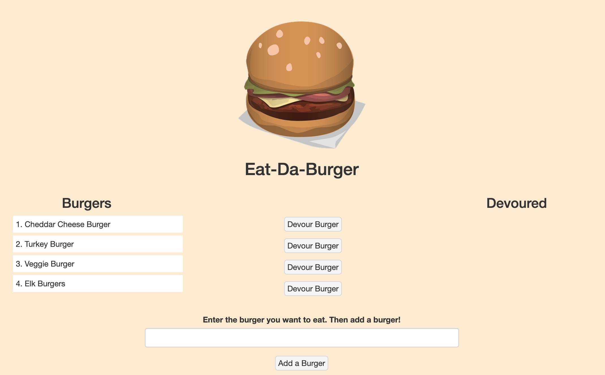

# Burger


Application is a burger logger. Users input burgers (stored in a mySQL table). Burgers available to be devoured are listed on the left (modified in the table). Press the "Devour Burger" button and devoured burgers are moved the Devoured list on the right. 


```
Run  on comand line as: node server.js

```

### Installing
Download Zip  
 
```
npm install package.json

```

## Built With
* MySQL
* Node
* Express
* Express Handlebars
* ORM 
* Javascript
* jQuery
* Bootstrap


 
## Special Features
Clean fast running app.

Runs on heroku.com: https://quiet-river-48564.herokuapp.com/





## Credits
Inquirer.js:  <a href="https://github.com/SBoudrias/Inquirer.js" target="_blank">SBoudrias</a>

Burger Image: <a href="https://pixabay.com/" target="_blank">pixabay.com</a>

Bootstrap <a href="https://getbootstrap.com" target="_blank">getbootstrap.com</a>


 
## Acknowledgments

* Rutgers Bootcamp Team


